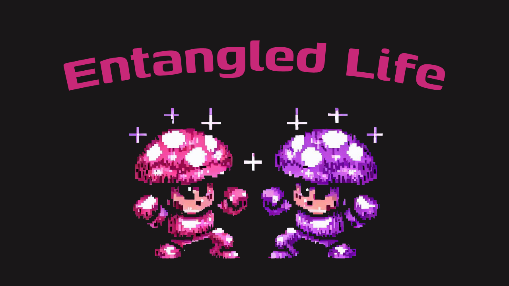

[]
(https://github.com/adriacabeza/entangled-life)

<h1>⚔️ Entangled Life 🍄</h1>

This game was inspired by the fascinating world of mushrooms and their complex interactions, as explored in the book 
"Entangled Life." Get ready to embark on a ferocious battle through mycelial networks while honing your coding 
skills. Players take on the roles of myceliums trying to look for food and expand by traversing a map with other
rival players. 

This game was inspired by the TODO

## Coding Challenges
The coding challenges in Entangled Life will include: 

- Implementing algorithms to make your mycelial growth and nutrient distribution.
- Block your rivals possibilities by limiting their reachable zone. 

## Game overview 

## Requirements
To participate in Entangled Life, you will need:

- Google Account (to sign in)
- A device that runs a browser.
- Basic coding knowledge and familiarity with Python 
- Enthusiasm for learning about mushrooms and mycology (NOT REALLY LOL)

## Want to collaborate?  
### Backend
### Frontend